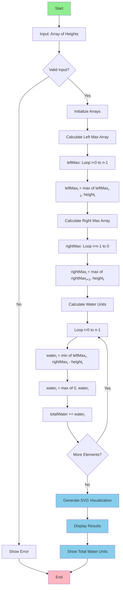

# 💧 Water Tank Problem - Interactive Solution

A beautiful and interactive web application that solves the classic **Water Tank Problem** (also known as "Trapping Rain Water") using Vanilla JavaScript, HTML, and CSS with SVG visualizations.

[](https://your-demo-link.com)
[](https://developer.mozilla.org/en-US/docs/Web/JavaScript)
[](LICENSE)

## 📋 Table of Contents

- [Problem Statement](#problem-statement)
- [Demo](#demo)
- [Algorithm Explanation](#algorithm-explanation)
- [Solution Flowchart](#solution-flowchart)
- [Features](#features)
- [Installation](#installation)
- [Usage](#usage)
- [Technical Details](#technical-details)
- [Examples](#examples)
- [Contributing](#contributing)
- [License](#license)

## 🎯 Problem Statement

Given an array of `n` non-negative integers representing the height of blocks, compute how many units of water can be trapped between the blocks after it rains.

**Input:** `[0, 4, 0, 0, 0, 6, 0, 6, 4, 0]`  
**Output:** `18 units`

### Visual Representation:
```
Height
  6 |     █     █
  5 |     █     █
  4 |  █  █  ░  █  █
  3 |  █  █  ░  █  █
  2 |  █  █  ░  █  █
  1 |  █  █  ░  █  █
  0 |  █  █  ░  █  █  █
    +------------------
      0  1  2  3  4  5  (index)

█ = Block    ░ = Water (18 units total)
```

## 🎬 Demo


### Live Application Features:
- 🎨 Real-time SVG visualization
- 📊 Interactive block height input
- 💡 Pre-loaded examples
- 📱 Responsive design
- ⚡ Instant calculation

## 🧮 Algorithm Explanation

The solution uses a **Dynamic Programming** approach with the following logic:

### Core Concept:
Water at any position is determined by:
```
water[i] = min(leftMax[i], rightMax[i]) - height[i]
```

Where:
- `leftMax[i]` = Maximum height on the left side of position `i`
- `rightMax[i]` = Maximum height on the right side of position `i`
- `height[i]` = Current block height at position `i`

### Step-by-Step Process:

1. **Calculate Left Maximum Heights**
   - Traverse from left to right
   - Store the maximum height encountered so far

2. **Calculate Right Maximum Heights**
   - Traverse from right to left
   - Store the maximum height encountered so far

3. **Calculate Water at Each Position**
   - Water level = min(leftMax, rightMax) - currentHeight
   - Sum all positive water values

4. **Return Total Water Units**

## 📊 Solution Flowchart



## 🎨 Visual Algorithm Flow

```
Example: [3, 0, 2, 0, 4]

Step 1: Calculate leftMax
Position:  0  1  2  3  4
Height:    3  0  2  0  4
leftMax:   3  3  3  3  4
           ↓  ↓  ↓  ↓  ↓

Step 2: Calculate rightMax
Position:  0  1  2  3  4
Height:    3  0  2  0  4
rightMax:  4  4  4  4  4
           ↓  ↓  ↓  ↓  ↓

Step 3: Calculate Water
Position:     0    1    2    3    4
min(L,R):     3    3    3    3    4
Height:       3    0    2    0    4
Water:        0    3    1    3    0
             ───────────────────────
Total Water: 0 + 3 + 1 + 3 + 0 = 7 units
```

## ✨ Features

### 🎯 Core Functionality
- ✅ Accurate water calculation using dynamic programming
- ✅ Real-time SVG visualization
- ✅ Support for any array size
- ✅ Handles edge cases (empty arrays, all zeros, single element)

### 🎨 User Interface
- 📊 Interactive SVG graphics showing blocks and water
- 🎨 Color-coded visualization (gray blocks, blue water)
- 📏 Grid lines and height markers
- 🔢 Individual water unit labels
- 📱 Fully responsive design

### 🛠️ Technical Features
- ⚡ O(n) time complexity
- 💾 O(n) space complexity
- 🚫 No external dependencies
- 🌐 Works in all modern browsers
- ♿ Accessible and user-friendly

## 🚀 Installation

### Prerequisites
- A modern web browser (Chrome, Firefox, Safari, Edge)
- No additional software required!

### Setup

1. **Clone the repository**
```bash
git clone https://github.com/yourusername/water-tank-problem.git
cd water-tank-problem
```

2. **Open the application**
```bash
# Simply open index.html in your browser
# Or use a local server (optional)
python -m http.server 8000
# Then navigate to http://localhost:8000
```

### Project Structure
```
water-tank-problem/
│
├── index.html          # Main application file (HTML + CSS + JS)
├── README.md           # This file
├── screenshots/        # Demo images and GIFs
│   └── demo.gif
└── LICENSE            # MIT License
```

## 💻 Usage

### Basic Usage

1. **Enter Heights**: Input block heights as comma-separated values
   ```
   Example: 0,4,0,0,0,6,0,6,4,0
   ```

2. **Click Calculate**: Press the "Calculate" button to see results

3. **View Visualization**: Observe the SVG diagram showing:
   - Gray blocks with heights
   - Blue water trapped between blocks
   - Individual water unit counts

### Try Examples

Click on any example button to quickly test different scenarios:
- **Example 1**: `[0,4,0,0,0,6,0,6,4,0]` → 18 units
- **Example 2**: `[3,0,2,0,4]` → 7 units
- **Example 3**: `[0,1,0,2,1,0,1,3,2,1,2,1]` → 6 units
- **Example 4**: `[4,2,0,3,2,5]` → 9 units

## 🔧 Technical Details

### Algorithm Complexity

| Metric | Value | Description |
|--------|-------|-------------|
| **Time Complexity** | O(n) | Three linear passes through the array |
| **Space Complexity** | O(n) | Additional arrays for leftMax and rightMax |
| **Best Case** | O(n) | Same for all inputs |
| **Worst Case** | O(n) | Same for all inputs |

### Code Structure

```javascript
// Main calculation function
function calculateWaterTrapped(heights) {
    // 1. Calculate left maximums
    // 2. Calculate right maximums
    // 3. Calculate water at each position
    // 4. Return total water
}

// Visualization function
function drawVisualization(heights, waterLevels) {
    // Creates SVG elements for blocks and water
}
```

### Browser Compatibility

| Browser | Minimum Version |
|---------|----------------|
| Chrome | 90+ |
| Firefox | 88+ |
| Safari | 14+ |
| Edge | 90+ |

## 📖 Examples

### Example 1: Standard Case
```javascript
Input:  [0, 4, 0, 0, 0, 6, 0, 6, 4, 0]
Output: 18 units

Explanation:
- Water trapped between blocks at positions 1, 2, 3, 4, 6
- Visual representation shows blue water filling gaps
```

### Example 2: Simple Case
```javascript
Input:  [3, 0, 2, 0, 4]
Output: 7 units

Breakdown:
- Position 1: 3 units (between 3 and 2)
- Position 2: 1 unit (between 2 and 4)
- Position 3: 3 units (between 2 and 4)
```

### Example 3: Edge Case
```javascript
Input:  [1, 1, 1, 1]
Output: 0 units

Reason: No water can be trapped when all blocks are the same height
```

## 🤝 Contributing

Contributions are welcome! Here's how you can help:

1. **Fork the repository**
2. **Create a feature branch**
   ```bash
   git checkout -b feature/AmazingFeature
   ```
3. **Commit your changes**
   ```bash
   git commit -m 'Add some AmazingFeature'
   ```
4. **Push to the branch**
   ```bash
   git push origin feature/AmazingFeature
   ```
5. **Open a Pull Request**

### Ideas for Contributions
- 🎨 Add more visualization styles
- 📊 Add animation effects
- 🌍 Add internationalization
- ♿ Improve accessibility
- 📱 Enhance mobile experience
- 🧪 Add unit tests

## 📝 License

This project is licensed under the MIT License - see the [LICENSE](LICENSE) file for details.

## 👨‍💻 Author

**Vijaya Raghava Medarametla**
- GitHub: [@VijayaRaghava139](https://github.com/VijayaRaghava139)
- Email: intothedatascience@gmail.com

## 🙏 Acknowledgments

- Interview assignment problem statement
- SVG visualization inspiration
- Dynamic programming algorithm approach
- Community feedback and contributions

## 📚 Additional Resources

- [LeetCode Problem #42 - Trapping Rain Water](https://leetcode.com/problems/trapping-rain-water/)
- [Dynamic Programming Tutorial](https://www.geeksforgeeks.org/dynamic-programming/)
- [SVG Tutorial](https://developer.mozilla.org/en-US/docs/Web/SVG)

---

<div align="center">

### ⭐ Star this repository if you find it helpful!

Made with ❤️ using Vanilla JavaScript

</div>
