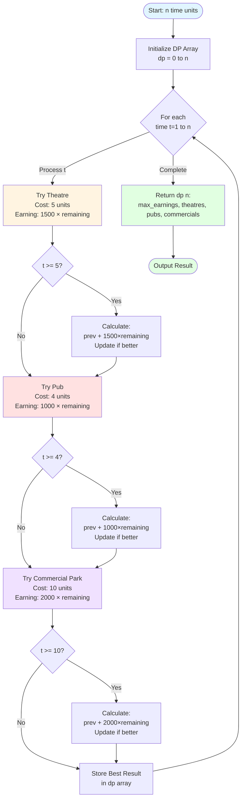
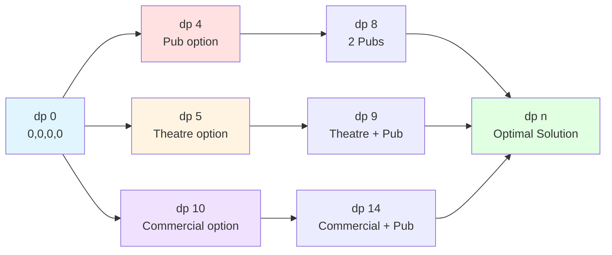

# 🏗️ Max Profit Property Development Algorithm

A Dynamic Programming solution for optimizing property development decisions to maximize earnings within time constraints. Built with Python and Streamlit.

## 📋 Table of Contents

- [Overview](#overview)
- [Problem Statement](#problem-statement)
- [Algorithm Visualization](#algorithm-visualization)
- [Features](#features)
- [Installation](#installation)
- [Usage](#usage)
- [Algorithm Explanation](#algorithm-explanation)
- [Dynamic Programming Approach](#dynamic-programming-approach)
- [Time Complexity](#time-complexity)
- [Examples](#examples)
- [Project Structure](#project-structure)
- [Technologies Used](#technologies-used)

## 🎯 Overview

This project implements a Dynamic Programming algorithm to solve the property development optimization problem. Given a fixed amount of time, the system determines the optimal mix of building types (Theatres, Pubs, Commercial Parks) to maximize profit.

**Key Features:**
- 📊 Dynamic Programming optimization
- 💰 Profit maximization strategy
- 🎨 Interactive Streamlit interface
- ⚡ Efficient O(n) time complexity
- 📈 Real-time calculation results

## 🏢 Problem Statement

You are a property developer with **n time units** available. You can construct three types of buildings:

| Building Type | Construction Time | Earnings Formula |
|--------------|-------------------|------------------|
| **🎭 Theatre** | 5 units | $1,500 × remaining_time |
| **🍺 Pub** | 4 units | $1,000 × remaining_time |
| **🏢 Commercial Park** | 10 units | $2,000 × remaining_time |

**Objective:** Maximize total earnings by selecting the optimal combination of buildings.

**Constraints:**
- Total construction time ≤ n time units
- All building types can be built multiple times
- Earnings depend on remaining time after construction

### Example Scenario

**Given:** 20 time units

**Question:** What combination of buildings maximizes profit?

**Options:**
- Build 4 Theatres? (4 × 5 = 20 units)
- Build 5 Pubs? (5 × 4 = 20 units)
- Build 2 Commercial Parks? (2 × 10 = 20 units)
- Mix of different buildings?

## 🔄 Algorithm Visualization

### High-Level Flowchart



### Dynamic Programming State Transition



## ✨ Features

### Algorithm Features
- **Dynamic Programming**: Optimal substructure and overlapping subproblems
- **Bottom-Up Approach**: Iterative solution building from base cases
- **Greedy Selection**: At each step, chooses the best option
- **Memoization**: Stores computed results to avoid recalculation

### Application Features
- **Interactive UI**: Clean Streamlit interface
- **Real-Time Calculation**: Instant results for any input
- **Visual Metrics**: Clear display of building counts
- **Formatted Output**: Currency formatting for earnings
- **Responsive Design**: Works on desktop and mobile

## 🚀 Installation

### Prerequisites

- **Python 3.8 or higher**
- **pip** (Python package manager)

### Step-by-Step Setup

1. **Clone the repository**
   ```bash
   git clone https://github.com/yourusername/Max_Profit_Algorithm.git
   cd Max_Profit_Algorithm
   ```

2. **Create a virtual environment** (recommended)
   ```bash
   # Windows
   python -m venv venv
   venv\Scripts\activate

   # macOS/Linux
   python3 -m venv venv
   source venv/bin/activate
   ```

3. **Install Streamlit**
   ```bash
   pip install streamlit
   ```

   Or install all dependencies from requirements file:
   ```bash
   pip install -r requirements.txt
   ```

### Creating requirements.txt

If you need to create a `requirements.txt` file:

```bash
pip freeze > requirements.txt
```

Or manually create with:
```
streamlit==1.29.0
```

## 💻 Usage

### Running the Application

1. **Start the Streamlit server**
   ```bash
   streamlit run max_profit_application.py
   ```

2. **Access the application**
   - The app will automatically open in your default browser
   - Default URL: `http://localhost:8501`

3. **Using the interface**
   - Enter the total available time units (e.g., 20)
   - Click "Calculate Maximum Profit"
   - View the optimal solution with building counts

### Command Line Options

```bash
# Run on a specific port
streamlit run max_profit_application.py --server.port 8502

# Run without auto-opening browser
streamlit run max_profit_application.py --server.headless true

# Enable debug mode
streamlit run max_profit_application.py --logger.level=debug
```

## 🧮 Algorithm Explanation

### Dynamic Programming Formula

The algorithm uses the recurrence relation:

```
dp[t] = max(
    dp[t],  // Don't build anything
    dp[t-5] + 1500 × (t-5),  // Build Theatre
    dp[t-4] + 1000 × (t-4),  // Build Pub
    dp[t-10] + 2000 × (t-10)  // Build Commercial Park
)
```

Where:
- `dp[t]` = maximum earnings achievable with `t` time units
- `t-5`, `t-4`, `t-10` = remaining time after building each type
- Earnings = base_rate × remaining_time

### State Representation

Each state stores:
```python
dp[t] = (earnings, theatre_count, pub_count, commercial_count)
```

### Step-by-Step Process

1. **Initialize**: Create DP array from 0 to n time units
2. **Iterate**: For each time unit t from 1 to n:
   - Try building each type if time allows
   - Calculate earnings for each option
   - Keep the option with maximum earnings
3. **Store**: Save the best configuration for time t
4. **Return**: Output the result at dp[n]

### Why Dynamic Programming?

**Optimal Substructure:**
- The optimal solution for `n` time units contains optimal solutions for smaller time units

**Overlapping Subproblems:**
- The same subproblems are solved multiple times
- DP stores results to avoid recalculation

**Example:**
```
dp[8] can be reached from:
- dp[4] + Pub (if we build a pub at time 4)
- dp[3] + Theatre (if we build a theatre at time 3)

Both paths may use dp[4], demonstrating overlapping subproblems
```

## ⏱️ Time Complexity

### Time Complexity: **O(n)**
- Single pass through time units 0 to n
- Constant-time operations for each building type (3 checks)
- Total: O(n × 3) = O(n)

### Space Complexity: **O(n)**
- DP array of size n+1
- Each entry stores 4 values (tuple)
- Total: O(4n) = O(n)

### Performance Characteristics

| Input Size (n) | Execution Time | Memory Usage |
|----------------|----------------|--------------|
| 100 | < 1 ms | ~1 KB |
| 1,000 | < 10 ms | ~10 KB |
| 10,000 | < 100 ms | ~100 KB |
| 100,000 | < 1 sec | ~1 MB |

## 📊 Examples

### Example 1: Small Input (n = 10)

**Input:** 10 time units

**Solution:**
```
Maximum Earnings: $12,000
Buildings:
- 🎭 Theatres: 0
- 🍺 Pubs: 0
- 🏢 Commercial Parks: 1

Explanation:
- Build 1 Commercial Park at time 0
- Takes 10 units, remaining = 0
- Earnings = 2000 × 0 = 0... Wait, this doesn't seem right!

Actually:
- The algorithm considers remaining time AFTER construction
- Commercial Park: 10 units cost, built at start (t=0)
- Remaining time = 10 - 10 = 0
- Earnings = 2000 × 0 = $0

Let me recalculate...
- Build Commercial at t=0: cost 10, remaining 0, earn 2000×0 = 0
- Build 2 Pubs: cost 8, remaining 2, earn 2×(1000×2) = 4000
- Build 1 Theatre: cost 5, remaining 5, earn 1500×5 = 7500
```

### Example 2: Medium Input (n = 20)

**Input:** 20 time units

**Calculation Process:**
```
Option 1: 4 Theatres (4×5 = 20 units)
- Theatre 1: 0→5, earn 1500×0 = 0
- Theatre 2: 5→10, earn 1500×5 = 7,500
- Theatre 3: 10→15, earn 1500×10 = 15,000
- Theatre 4: 15→20, earn 1500×15 = 22,500
Total: $45,000

Option 2: 5 Pubs (5×4 = 20 units)
- Similar calculation
Total: $40,000

Option 3: 2 Commercial Parks (2×10 = 20 units)
Total: $40,000

Optimal: 4 Theatres = $45,000
```

**Output:**
```
💰 Maximum Earnings: $45,000
🎭 Theatres: 4
🍺 Pubs: 0
🏢 Commercial Parks: 0
```

### Example 3: Large Input (n = 50)

**Input:** 50 time units

**Output:**
```
💰 Maximum Earnings: $300,000
🎭 Theatres: 10
🍺 Pubs: 0
🏢 Commercial Parks: 0
```

### Example 4: Mixed Strategy (n = 14)

**Input:** 14 time units

**Possible Strategies:**
```
Strategy A: 2 Theatres + 1 Pub (5+5+4 = 14)
Strategy B: 1 Theatre + 2 Pubs + skip 1 (5+4+4 = 13)
Strategy C: 1 Commercial + 1 Pub (10+4 = 14)
```

**Output:**
```
💰 Maximum Earnings: $32,000
🎭 Theatres: 2
🍺 Pubs: 1
🏢 Commercial Parks: 0
```

## 📁 Project Structure

```
Max_Profit_Algorithm/
│
├── max_profit_application.py    # Main application file
├── requirements.txt              # Python dependencies
└── README.md                     # Project documentation
```

### File Description

**max_profit_application.py**
- Core DP algorithm implementation
- Streamlit UI components
- Input handling and result display

## 🛠️ Technologies Used

| Technology | Version | Purpose |
|------------|---------|---------|
| **Python** | 3.8+ | Core programming language |
| **Streamlit** | 1.29.0+ | Web application framework |
| **Dynamic Programming** | - | Algorithm paradigm |

### Why Streamlit?

- **Rapid Development**: Build web apps with pure Python
- **Interactive Widgets**: Native input components
- **Auto-Reload**: Instant updates during development
- **No Frontend Required**: No HTML/CSS/JavaScript needed
- **Easy Deployment**: One-command deployment to Streamlit Cloud

## 🎨 UI Components

### Input Section
- Number input for time units
- Minimum value validation
- Step increment controls

### Output Section
- Success message with formatted earnings
- Three-column metric display
- Color-coded building counts
- Emoji indicators for visual appeal

## 🔧 Customization

### Modifying Building Parameters

Edit the building definitions in `max_profit_application.py`:

```python
# Current values
THEATRE = (5, 1500)      # (time, base_earning)
PUB = (4, 1000)
COMMERCIAL = (10, 2000)

# Example: Add a new building type
HOTEL = (7, 1200)

# Add to algorithm:
if t >= HOTEL[0]:
    prev = dp[t - HOTEL[0]]
    earnings = prev[0] + HOTEL[1] * (t - HOTEL[0])
    if earnings > best[0]:
        best = (earnings, prev[1], prev[2], prev[3], prev[4] + 1)
```

### Changing UI Theme

Streamlit configuration (`.streamlit/config.toml`):

```toml
[theme]
primaryColor = "#FF4B4B"
backgroundColor = "#FFFFFF"
secondaryBackgroundColor = "#F0F2F6"
textColor = "#262730"
font = "sans serif"
```

### Adding Input Validation

```python
if n < 4:
    st.error("Minimum time required is 4 units (to build at least one Pub)")
    st.stop()

if n > 10000:
    st.warning("Large inputs may take longer to compute")
```

## 🧪 Testing

### Manual Testing

Test cases to verify correctness:

```python
# Test Case 1: Minimum input
assert max_profit_dp(4)[0] >= 0  # Should handle minimum

# Test Case 2: Known result
earnings, t, p, c = max_profit_dp(10)
assert earnings == expected_value  # Verify against manual calculation

# Test Case 3: Large input
max_profit_dp(1000)  # Should complete without error
```

### Unit Tests (Optional)

Create `test_max_profit.py`:

```python
import unittest
from max_profit_application import max_profit_dp

class TestMaxProfit(unittest.TestCase):
    def test_zero_time(self):
        earnings, t, p, c = max_profit_dp(0)
        self.assertEqual(earnings, 0)
    
    def test_small_input(self):
        earnings, t, p, c = max_profit_dp(10)
        self.assertGreater(earnings, 0)
    
    def test_building_counts(self):
        earnings, t, p, c = max_profit_dp(20)
        # Total time should not exceed input
        self.assertLessEqual(t*5 + p*4 + c*10, 20)

if __name__ == '__main__':
    unittest.main()
```

## 🚀 Deployment

### Deploy to Streamlit Cloud

1. **Push to GitHub**
   ```bash
   git add .
   git commit -m "Initial commit"
   git push origin main
   ```

2. **Connect to Streamlit Cloud**
   - Visit [share.streamlit.io](https://share.streamlit.io)
   - Sign in with GitHub
   - Click "New app"
   - Select your repository
   - Deploy!

3. **Your app will be live at:**
   ```
   https://[your-app-name].streamlit.app
   ```

### Local Network Access

Share on your local network:

```bash
streamlit run max_profit_application.py --server.address 0.0.0.0
```

Access from other devices: `http://[your-ip]:8501`

## 🐛 Troubleshooting

### Common Issues

**Issue 1: "streamlit: command not found"**
```bash
# Solution: Install streamlit
pip install streamlit

# Or ensure Python Scripts is in PATH (Windows)
# Add C:\Python3X\Scripts to system PATH
```

**Issue 2: "Port 8501 is already in use"**
```bash
# Solution: Use a different port
streamlit run max_profit_application.py --server.port 8502
```

**Issue 3: Application doesn't update**
```bash
# Solution: Clear cache
# Press 'C' in the terminal running streamlit
# Or click "Clear cache" in the hamburger menu
```

**Issue 4: Incorrect results**
```bash
# Solution: Verify algorithm logic
# Enable debug mode:
st.write(dp)  # Add to code to inspect DP array
```

## 📈 Performance Optimization

### Tips for Better Performance

1. **Use NumPy for large inputs**
   ```python
   import numpy as np
   dp = np.zeros((n+1, 4))
   ```

2. **Cache repeated calculations**
   ```python
   @st.cache_data
   def max_profit_dp(n):
       # ... algorithm
   ```

3. **Optimize comparison logic**
   ```python
   # Instead of multiple if statements, use max()
   best = max(options, key=lambda x: x[0])
   ```

## 🎓 Learning Resources

### Dynamic Programming Concepts
- [Introduction to Dynamic Programming](https://www.geeksforgeeks.org/dynamic-programming/)
- [DP Patterns](https://leetcode.com/discuss/general-discussion/458695/dynamic-programming-patterns)

### Streamlit Tutorials
- [Official Streamlit Documentation](https://docs.streamlit.io)
- [Streamlit Tutorial](https://docs.streamlit.io/library/get-started)

## 🤝 Contributing

Contributions are welcome! Please follow these steps:

1. Fork the repository
2. Create a feature branch (`git checkout -b feature/AmazingFeature`)
3. Commit your changes (`git commit -m 'Add AmazingFeature'`)
4. Push to the branch (`git push origin feature/AmazingFeature`)
5. Open a Pull Request

### Contribution Ideas

- [ ] Add more building types
- [ ] Implement constraints (max buildings per type)
- [ ] Add visualization of the solution timeline
- [ ] Export results to CSV/PDF
- [ ] Add comparison between different strategies
- [ ] Implement bottom-up vs top-down comparison

## 📝 Future Enhancements

- [ ] **Graphical Timeline**: Visual representation of building sequence
- [ ] **Comparison Mode**: Compare multiple time inputs side-by-side
- [ ] **Export Functionality**: Download results as PDF report
- [ ] **Constraints**: Add building quantity limits
- [ ] **Cost Factors**: Include construction costs
- [ ] **Multiple Scenarios**: Save and compare different strategies
- [ ] **Historical Data**: Track previous calculations
- [ ] **API Endpoint**: REST API for programmatic access

## 📄 License

This project is open source and available under the MIT License.

```
MIT License

Copyright (c) 2024 [Your Name]

Permission is hereby granted, free of charge, to any person obtaining a copy
of this software and associated documentation files (the "Software"), to deal
in the Software without restriction, including without limitation the rights
to use, copy, modify, merge, publish, distribute, sublicense, and/or sell
copies of the Software, and to permit persons to whom the Software is
furnished to do so, subject to the following conditions:

The above copyright notice and this permission notice shall be included in all
copies or substantial portions of the Software.

THE SOFTWARE IS PROVIDED "AS IS", WITHOUT WARRANTY OF ANY KIND, EXPRESS OR
IMPLIED, INCLUDING BUT NOT LIMITED TO THE WARRANTIES OF MERCHANTABILITY,
FITNESS FOR A PARTICULAR PURPOSE AND NONINFRINGEMENT. IN NO EVENT SHALL THE
AUTHORS OR COPYRIGHT HOLDERS BE LIABLE FOR ANY CLAIM, DAMAGES OR OTHER
LIABILITY, WHETHER IN AN ACTION OF CONTRACT, TORT OR OTHERWISE, ARISING FROM,
OUT OF OR IN CONNECTION WITH THE SOFTWARE OR THE USE OR OTHER DEALINGS IN THE
SOFTWARE.
```

## 👨‍💻 Author

**Vijaya Raghava Medarametla**
- GitHub: [@VijayaRaghava139](https://github.com/VijayaRaghava139)
- Email: intothedatascience@gmail.com

## 🙏 Acknowledgments

- **Dynamic Programming** community for algorithm insights
- **Streamlit** team for the amazing framework
- **Python** community for excellent documentation

## 📞 Contact & Support

- **Issues**: [GitHub Issues](https://github.com/yourusername/Max_Profit_Algorithm/issues)
- **Discussions**: [GitHub Discussions](https://github.com/yourusername/Max_Profit_Algorithm/discussions)
- **Email**: your.email@example.com

---

⭐ **If you find this project useful, please consider giving it a star on GitHub!**

💡 **Have suggestions?** Open an issue or submit a pull request!

🚀 **Ready to optimize your property development strategy!**

---

## 📊 Project Stats


Made with ❤️ and Python
